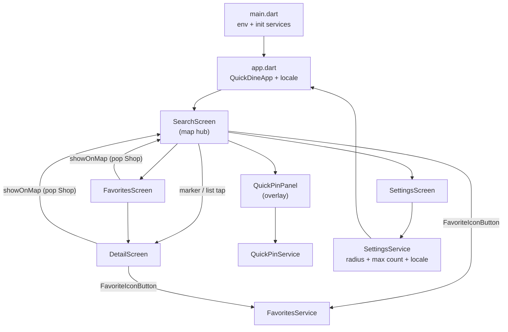

# Architecture

## App flow

### Screens

| Screen | Role |
|--------|------|
| **SearchScreen** | Hub: full-screen map, AppBar (title + ♥ + settings), floating radius/count card, bottom **Search pill**, `DraggableScrollableSheet` result list, orange map markers, Quick Pin overlay, GPS on startup |
| **DetailScreen** | Photo, address, hours, access (segmented UI); ♥ toggle; **Show on map** if `shop.hasLocation` |
| **FavoritesScreen** | Saved shops list; tap → detail; forwards show-on-map `Shop` to SearchScreen |
| **SettingsScreen** | Default search radius, default max count, language, clear favorites/pins |

There is **no dedicated list screen**. Results appear as **orange map markers** and in the **bottom sheet list** (`ShopListTile`: name, access, thumbnail).

Navigation: `Navigator.push` + `MaterialPageRoute`. `SearchScreen` is `MaterialApp` home.

## SearchScreen layout (Stack in body)

Body uses `LayoutBuilder` — **extent math must use `constraints.maxHeight`**, not full screen height (AppBar excluded).

| Layer (bottom → top) | Widget |
|----------------------|--------|
| Map | `SearchMapStack` → `MapLocationPicker` |
| Bottom sheet | `SearchResultsSheet` (when `_isSheetVisible` && results) |
| Credit bar | `HotPepperCreditBar` (only when sheet hidden) |
| Floating filters | `SearchFloatingControls` (radius + max count) |
| Search CTA | `SearchPillButton` (bottom-center; Y tracks sheet via `_sheetExtent`) |

**State flags:** `_isLoading`, `_isQuickPinPanelOpen`, `_isSheetVisible`, `_sheetExtent`, `_searchResults`.

## Startup sequence (`main.dart`)

1. `dotenv.load(assets/env)`
2. `MapsKeyService.initialize()`
3. `FavoritesService.instance.init()`
4. `QuickPinService.instance.init()`
5. `SettingsService.instance.init()`
6. `runApp(QuickDineApp())`

On first frame, `SearchScreen._applyCurrentLocation(showFeedback: false)`.

## Layer conventions

### Widgets (`widgets/`)

| Widget | Role |
|--------|------|
| `SearchMapStack` | Map + Quick Pin panel + bouncy Quick Pin button + my-location |
| `MapLocationPicker` | Markers, search radius circle, camera, padding |
| `SearchFloatingControls` | Top card: `SearchRadiusDropdown` + `SearchCountDropdown` |
| `SearchPillButton` | Bottom pill: primary CTA (`searchPill` l10n) |
| `SearchResultsSheet` | Draggable list; close animates to 0 then unmounts |
| `SearchCountDropdown` / `SearchRadiusDropdown` | Shared by Search + Settings |
| `DetailSection` (`detail_row.dart`) | Multi-segment values in bullet boxes |
| `ShopListTile` | Thumbnail + name + access (+ image credit) |

### Services (`services/`)

| Service | Responsibility |
|---------|----------------|
| `HotPepperApi` | REST → `List<Shop>`; user `range` + `count` |
| `LocationService` | Geolocator; `LocationException` |
| `FavoritesService` | `ChangeNotifier`; `favorite_shops` pref |
| `QuickPinService` | `ChangeNotifier`; `quick_pins` pref |
| `SettingsService` | `defaultMaxSearchCount`, `defaultSearchRadius`, `locale` |
| `MapsKeyService` | iOS Maps key via MethodChannel |

### Constants (`constants/`)

- `search_radius.dart` — range 1~5, `clampSearchRadius()`, `searchRadiusMeters()`
- `search_count.dart` — `[10,20,30,50,100]`, `clampSearchCount()`
- `ApiConstants` — URLs, env keys, Tokyo default, `maxResultCount` (100)

### Detail text splitting (`detail_row.dart`)

- Default: `,` / `、`
- Access field: also `/` / `／` (`accessSplitPattern`)
- Single or multiple segments: same bullet-box style

## Local persistence (`shared_preferences`)

| Key | Service | Content |
|-----|---------|---------|
| `favorite_shops` | FavoritesService | JSON `Shop` list |
| `quick_pins` | QuickPinService | JSON `QuickPin` list |
| `search_max_count` | SettingsService | 10 / 20 / 30 / 50 / 100 |
| `search_range` | SettingsService | 1~5 (300m~3000m) |
| `app_locale` | SettingsService | `ko` / `ja` / `en` (absent = system) |

## Show on map flow

1. `DetailScreen` AppBar map icon → `Navigator.pop(context, shop)`
2. `SearchScreen._showShopOnMap(shop)`:
   - Updates `_searchLat` / `_searchLng` (search center moves)
   - Keeps/adds shop in `_searchResults`
   - **Does not** call `moveTo()` (would clear results via `onLocationChanged`)

## Search / bottom sheet interaction

- Search pill tap → API call → `_isSheetVisible = true`, sheet at `initialChildSize` (0.3)
- Sheet dismissed (X or swipe to 0) → `_isSheetVisible = false`; pill reappears at bottom
- Pill tap when results exist but sheet hidden → reopens sheet without re-fetch
- `_sheetExtent` from `SearchResultsSheet.onExtentChanged` — pill `bottom` = `extent × stackHeight + margin`

## Credit on SearchScreen

SearchScreen **does not** use `ScreenWithCredit`. Credits:
- Sheet hidden: `HotPepperCreditBar` at screen bottom
- Sheet open: credit in list footer inside `SearchResultsSheet`

Other API screens (Detail, Favorites, Settings) use `ScreenWithCredit`.

## Dependencies (pubspec)

`http`, `geolocator`, `flutter_dotenv`, `google_maps_flutter`, `url_launcher`, `shared_preferences`, `flutter_localizations`, `intl`.
