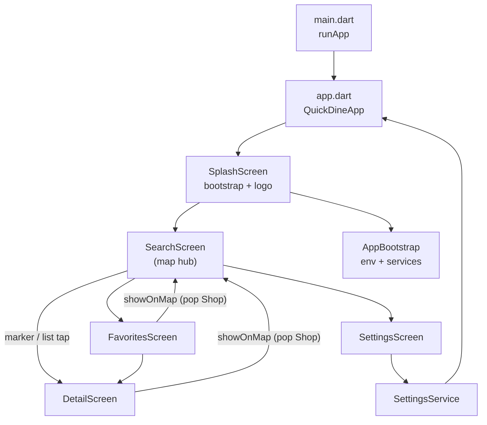

# Architecture

## App flow

### Screens

| Screen | Role |
|--------|------|
| **SplashScreen** | Primary background + white Vrowdice logo; runs `AppBootstrap`; min ~1.2s then `SearchScreen` |
| **SearchScreen** | Hub: map, AppBar (QuickDine `AppLogo` + ♥ + settings), **unified search panel** (radius, count, genre chips), search pill, bottom sheet, Quick Pins |
| **DetailScreen** | Photo, name, `[genre] catch` subtitle, call/web actions, budget/address/hours/access cards; show-on-map; ♥ |
| **FavoritesScreen** | Saved shops; tap → detail |
| **SettingsScreen** | Defaults, language, clear data; app info block + `StudioCredit` |

No dedicated list screen — results are map markers + `SearchResultsSheet`.

Navigation: `Navigator.push` + `MaterialPageRoute`. Initial route: `SplashScreen` → replaces with `SearchScreen`.

## SearchScreen layout (Stack in body)

Use `LayoutBuilder` — **extent math uses `constraints.maxHeight`** (body only, AppBar excluded).

| Layer (bottom → top) | Widget |
|----------------------|--------|
| Map | `SearchMapStack` |
| Bottom sheet | `SearchResultsSheet` (conditional) |
| Credit bar | `HotPepperCreditBar` (sheet hidden only) |
| Search panel | `SearchFloatingControls` (dropdowns + horizontal genre chips) |
| Search CTA | `SearchPillButton` (tracks `_sheetExtent`) |

**State:** `_isLoading`, `_isQuickPinPanelOpen`, `_isSheetVisible`, `_sheetExtent`, `_searchResults`, `_selectedRadius`, `_selectedMaxCount`, `_selectedGenreCode` (null = all genres).

Genre change clears results (re-search required). Pill reopens sheet without re-fetch if results exist.

## Startup sequence

1. `main()` — `WidgetsFlutterBinding.ensureInitialized()` → `runApp(QuickDineApp())`
2. `SplashScreen` — parallel: `AppBootstrap.ensureInitialized()` + min display delay
3. `AppBootstrap` — `dotenv`, `MapsKeyService`, favorites, quick pins, settings
4. Navigate to `SearchScreen` → silent GPS via `_applyCurrentLocation`

Native Android/iOS launch splash uses primary color (+ white logo on Android) for seamless handoff.

## Theme (`theme/app_theme.dart`)

- **Primary** `#C4683A` (terracotta) — AppBar, search pill, selected genre chip
- **Secondary** `#3D6B5C` (sage) — icons, detail accents, input focus
- Noto Sans / KR / JP via `google_fonts`
- `MaterialApp.debugShowCheckedModeBanner: false`

## Key widgets

| Widget | Role |
|--------|------|
| `SearchFloatingControls` | Single card: radius + count row, genre `ChoiceChip` row (StadiumBorder) |
| `SearchPillButton` | Primary CTA |
| `SearchResultsSheet` | Draggable list; snap 0 / 0.3 / 0.8 |
| `ShopDetailActions` | `tel:` + HotPepper web URL (`url_launcher`) |
| `DetailSection` | Bullet-box info blocks |
| `AppLogo` | QuickDine `assets/images/app_icon.png` |
| `StudioCredit` | Settings footer — Developed by Vrowdice (black logo) |

## Services

| Service | Role |
|---------|------|
| `HotPepperApi` | `searchShops(lat, lng, count, range, genre?)` |
| `AppBootstrap` | One-shot init from splash |
| `SettingsService` | `search_range`, `search_max_count`, `app_locale` |
| Others | GPS, favorites, quick pins, Maps key |

## Local persistence

| Key | Content |
|-----|---------|
| `favorite_shops` | JSON `Shop` (all model fields in `toJson`) |
| `quick_pins` | JSON `QuickPin` |
| `search_max_count` | 10–100 |
| `search_range` | 1–5 |
| `app_locale` | ko / ja / en (optional) |

## Show on map

`DetailScreen` / `FavoritesScreen` → `Navigator.pop(context, shop)` → `_showShopOnMap`. Updates center coords; **does not** call `moveTo()` (preserves results).

## Credits

- **SearchScreen:** sheet footer or bottom bar — not `ScreenWithCredit`
- **Detail / Favorites / Settings:** `ScreenWithCredit` + `HotPepperImageCredit` on images
- HotPepper Japanese credit text mandatory in all locales
- Vrowdice `StudioCredit` is separate from HotPepper compliance (Settings only)

## Dependencies

`http`, `geolocator`, `flutter_dotenv`, `google_maps_flutter`, `url_launcher`, `shared_preferences`, `flutter_localizations`, `intl`, `google_fonts`.
