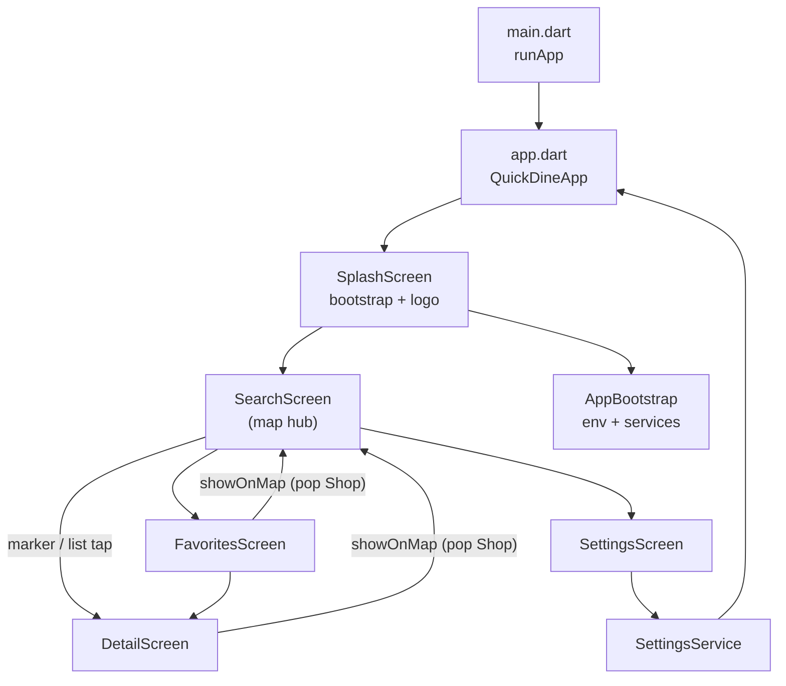

# Architecture

## App flow

### Screens

| Screen | Role |
|--------|------|
| **SplashScreen** | Primary background + white Vrowdice logo; runs `AppBootstrap`; min ~1.2s then `SearchScreen` |
| **SearchScreen** | Hub: map, AppBar (QuickDine `AppLogo` + ♥ + settings), **unified search panel** (radius, count, parking/private-room filters, genre chips), search pill, bottom sheet, Quick Pins |
| **DetailScreen** | Photo, name, `[genre] catch` subtitle, call/web actions, budget/address/hours/access cards; show-on-map; ♥ |
| **FavoritesScreen** | Saved shops; tap → detail via `pushShopDetail` |
| **SettingsScreen** | Defaults, language, clear data (`clearWithConfirm`); app info block + `StudioCredit` |

No dedicated list screen — results are map markers + `SearchResultsSheet`.

Navigation: `Navigator.push` + `MaterialPageRoute`. Detail navigation helper: `pushShopDetail()` in `navigation_helpers.dart`. Initial route: `SplashScreen` → replaces with `SearchScreen`.

## SearchScreen layout (Stack in body)

Use `LayoutBuilder` — **extent math uses `constraints.maxHeight`** (body only, AppBar excluded).

| Layer (bottom → top) | Widget |
|----------------------|--------|
| Map + search pill | `_buildMapAndSearchPill` inside `ValueListenableBuilder<double>` |
| Bottom sheet | `SearchResultsSheet` (conditional) |
| Credit bar | `HotPepperCreditBar` (sheet hidden only) |
| Search panel | `SearchFloatingControls` (dropdowns + filter chips + genre chips) |

**Sheet extent:** `_sheetExtentNotifier` (`ValueNotifier<double>`) — updated by `SearchResultsSheet.onExtentChanged`. Insets computed via `SearchOverlayMetrics.from()` (map bottom padding, Quick Pin panel inset, search pill bottom). **Do not** call `setState` on every drag frame.

**State:** `_isLoading`, `_isQuickPinPanelOpen`, `_isSheetVisible`, `_searchResults`, `_searchRequestId`, `_selectedRadius`, `_selectedMaxCount`, `_selectedGenreCode` (null = all genres), `_filterParking`, `_filterPrivateRoom`.

**Search guards:** `_isLoading` early return; `_searchRequestId` ignores stale API responses.

Genre / parking / private-room change clears results (re-search required). Pill reopens sheet without re-fetch if results exist (`_showResultsSheet`).

**Helpers:** `_whenIdle<T>()` disables floating controls while loading; `_buildFloatingControls()`; `_buildMapAndSearchPill()`.

## SearchResultsSheet

- `DraggableScrollableSheet` — snap 0 / 0.3 / 0.8
- Header: drag handle (center), **random pick** `Icons.casino_outlined` (left), close (right)
- Random pick: `Random().nextInt(shops.length)` → `onShopTap` → `DetailScreen`
- Favorites: single `ListenableBuilder` on list; `ShopListTile(isFavorite: …)` — not per-row listeners

## Startup sequence

1. `main()` — `WidgetsFlutterBinding.ensureInitialized()` → `runApp(QuickDineApp())`
2. `SplashScreen` — parallel: `AppBootstrap.ensureInitialized()` + min display delay
3. `AppBootstrap` — `dotenv`, `MapsKeyService`, favorites, quick pins, settings
4. Navigate to `SearchScreen` → silent GPS via `_applyCurrentLocation`

Native Android/iOS launch splash uses primary color (+ white logo on Android) for seamless handoff.

## Theme (`theme/app_theme.dart`)

- **Primary** `#C4683A` (terracotta) — AppBar, search pill, selected genre chip
- **Secondary** `#3D6B5C` (sage) — icons, filter chips, detail accents, input focus
- Noto Sans / KR / JP via `google_fonts`
- `MaterialApp.debugShowCheckedModeBanner: false`

## Key widgets

| Widget | Role |
|--------|------|
| `SearchFloatingControls` | Single card: radius + count row; **FilterChip** row (parking, private room) + divider + genre **ChoiceChip** row |
| `SearchPillButton` | Primary CTA; bottom tracks `SearchOverlayMetrics.searchPillBottom` |
| `SearchResultsSheet` | Draggable list; random pick; snap sizes |
| `ShopDetailActions` | `tel:` + HotPepper web URL (`url_launcher`) |
| `DetailSection` | Bullet-box info blocks |
| `AppLogo` | QuickDine `assets/images/app_icon.png` |
| `StudioCredit` | Settings footer — Developed by Vrowdice (black logo) |
| `FavoriteIconButton` | Optional `isFavorite` prop to skip nested `ListenableBuilder` |

## Utils

| File | Role |
|------|------|
| `search_overlay_metrics.dart` | Sheet extent → `mapBottomPadding`, `panelBottomInset`, `searchPillBottom` |
| `navigation_helpers.dart` | `pushShopDetail(context, shop)` |
| `confirm_dialog.dart` | `showConfirmDialog`, `clearWithConfirm` (settings / quick pin delete) |
| `l10n_helpers.dart` | `locationErrorMessage`, `languageLabel`, `genreLabel` |
| `url_launcher_helpers.dart` | `launchPhoneCall`, `launchExternalWebUrl` |

## Services

| Service | Role |
|---------|------|
| `HotPepperApi` | `searchShops(lat, lng, count, range, genre?, parking?, privateRoom?)` — 15s HTTP timeout |
| `AppBootstrap` | One-shot init from splash |
| `SettingsService` | `search_range`, `search_max_count`, `app_locale` |
| Others | GPS, favorites, quick pins, Maps key |

## Local persistence

| Key | Content |
|-----|---------|
| `favorite_shops` | JSON `Shop` (all model fields in `toJson`) |
| `quick_pins` | JSON `QuickPin` |
| `search_max_count` | 10–100 |
| `search_range` | 1–5 |
| `app_locale` | ko / ja / en (optional) |

## Show on map

`DetailScreen` / `FavoritesScreen` → `Navigator.pop(context, shop)` → `_showShopOnMap`. Updates center coords; **does not** call `moveTo()` (preserves results).

## Credits

- **SearchScreen:** sheet footer or bottom bar — not `ScreenWithCredit`
- **Detail / Favorites / Settings:** `ScreenWithCredit` + `HotPepperImageCredit` on images
- HotPepper Japanese credit text mandatory in all locales
- Vrowdice `StudioCredit` is separate from HotPepper compliance (Settings only)

## Performance notes (maintain when editing)

- Sheet drag: `ValueNotifier` + `SearchOverlayMetrics` — avoid full `SearchScreen` rebuild
- `MapLocationPicker`: cache markers/circles; rebuild only when shops/pins/radius/position change; dispose `GoogleMapController`
- Search: `_searchRequestId` + `_isLoading` guard against duplicate requests
- Results list favorites: one `ListenableBuilder` at list level

## Dependencies

`http`, `geolocator`, `flutter_dotenv`, `google_maps_flutter`, `url_launcher`, `shared_preferences`, `flutter_localizations`, `intl`, `google_fonts`.
